# Database Diagram

Grouped by domain; common columns (`id`, timestamps, `created_by`) and the polymorphic links from `documents`, `tasks`, `compliance_reviews`, `compliance_exceptions`, and `audit_logs` (which attach to any record) are omitted for readability. Full field spec: `../docs/01-data-model.md`.

```mermaid
erDiagram
  users ||--o{ suppliers : "approves/creates"
  suppliers ||--o{ supplier_facilities : has
  suppliers ||--o{ supplier_licenses : holds
  suppliers ||--o{ supplier_inspections : has
  suppliers ||--o{ supplier_insurance : carries
  suppliers ||--o{ products : offers
  suppliers ||--o{ compensation_agreements : signs
  users }o--|| suppliers : "supplier_user scoped to"

  products ||--o{ product_regulatory_classifications : "classified by counsel basis"
  products ||--o{ product_documents : evidenced_by
  products ||--o{ product_approved_buyer_types : "allow-list"
  products ||--o{ product_geographic_restrictions : "state allow-list"

  buyer_entities ||--o{ buyer_facilities : has
  buyer_entities ||--o{ buyer_contacts : has
  buyer_entities ||--o{ buyer_licenses : holds
  buyer_entities ||--o{ buyer_attestations : signs

  supplier_licenses ||--o{ license_verifications : "verified (XOR)"
  buyer_licenses ||--o{ license_verifications : "verified (XOR)"

  outreach_campaigns ||--o{ outreach_messages : sends
  buyer_contacts ||--o{ outreach_messages : receives
  buyer_contacts ||--o{ suppression_list : "may be suppressed"
  buyer_contacts ||--o{ meetings : attends

  buyer_entities ||--o{ opportunities : has
  opportunities ||--o{ supplier_introductions : "consented intro"
  opportunities ||--o{ quotes : has
  suppliers ||--o{ quotes : "approves pricing"
  opportunities ||--o{ meetings : includes

  suppliers ||--o{ orders : reports
  buyer_entities ||--o{ orders : places
  quotes ||--o{ orders : converts
  orders ||--o{ order_line_items : contains
  products ||--o{ order_line_items : references
  orders ||--o{ collected_revenue : "supplier-reported collections"
  orders ||--o{ reorders : seeds

  compensation_agreements ||--o{ commission_calculations : governs
  collected_revenue ||--|| commission_calculations : "1:1 basis"
  suppliers ||--o{ commission_payments : pays
  commission_payments }o--o{ commission_calculations : applies_to

  complaints ||--o| adverse_events : "may escalate to"
  products ||--o{ recalls : subject_of
  suppliers ||--o{ recalls : initiates
  compliance_reviews ||--o{ regulatory_updates : "resolves action_required"
```

Flow summary: **suppliers → products → (allow-lists) → buyers → (verification) → outreach → opportunities → introductions → quotes → orders → collections → commissions**, with compliance tables (reviews, exceptions, complaints, AEs, recalls, regulatory updates) and the append-only audit log cross-cutting every stage.
